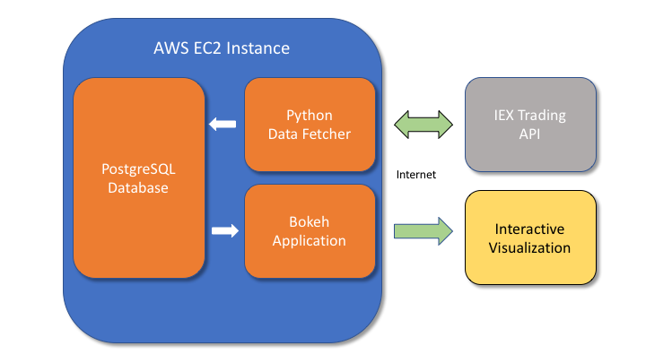

# Building an interactive, data-driven web-application using Amazon EC2 and Python

Modern data is generated massively and flows constantly. We want to understand that data, and often we want to understand that data *right now*. Being familiar with methods to produce infrastructure that is capable of processing data on the fly is a useful skill, and a great example of this is building visualization tools that display data as it is generated, allowing you to visualize changes in real time. In this post I'll use Python build such a data visualization tool, specifically a stock ticker. Using [IEX trading's API](https://iextrading.com), we will create a multithreaded service that constantly queries information about stock prices and stores it in a PostgreSQL database. We'll then build an interactive Python application that fetches data from this database using `psychopg2` and visualizes it interactively with `Bokeh`. Finally, we will deploy this application on the Cloud using Amazon Web Services EC2, making our visualization publicly accessible through an elastic ip. All of the code for this can be found [on Github](https://github.com/apryor6/stockstreamer), and you can view the application live [here](http://13.59.160.9:5006/stockstreamer).

## Application Structure

The following diagram illustrates roughly how the logic of our application will flow.

A data fetching program written in Python will repeatedly request information from IEX Trading, which provides [a useful API](https://iextrading.com/developer/) for querying information about stocks over the internet. The program will then store this information in a PostgreSQL database, where a second Python application will use that data to generate an interactive visualiation using [`Bokeh`](https://bokeh.pydata.org/en/latest/). `Bokeh` is a powerful visualization framework that links Javascript and Python, allowing objects to be created with relatively simple Python code that are then viewable in a web browser. In its basic form, `Bokeh` uses Python to create HTML and then leaves the Python ecosystem behind. However, we want there to be ongoing communication link between Python and our visualization so that the data can be updated constantly, and this can be accomplished with the additional of a [`Bokeh` server](https://bokeh.pydata.org/en/latest/docs/user_guide/server.html). All of these components can be created in just a few hundred lines of Python and will be contained within a cloud machine on Amazon EC2.

## Setting up the EC2 instance

First we want to get our remote server up and running on the cloud. If you don't already have an account with AWS, create one and then login to the console [here](https://aws.amazon.com/console/). Go to `Services -> EC2` and select `Instances` and click `Launch Instance`. Choose the Ubuntu disk image. Next you'll select the hardware. The free tier is sufficient for this demo, but be aware that such a server won't be particularly responsive with only one core to handle all of the work. This can be improved by upgrading the machine, but be aware that you will be liable for any charges. Click next until "Configure Security Group". Click "Add rule" and choose type "All TCP" and then set Source to "anywhere". This will allow all network traffic to reach our web application. In a proper business application one should take more care with network security, but for this use case it's fine. Click "Launch", then select the drop down and create a new key pair, download it, and launch the instance. This key pair is for authentication purposes, and must be kept secret. You'll need the private key in order to ssh into the EC2 instance, and if you lose it you will be forced to launch a new instance from scratch and recreate the key pair. After a few minutes the Instance State should indicate running from the instance dashboard, and the machine is good to go. 

## Establishing a static ("elastic") IP

Amazon automatically assigns an IP address to each EC2 instance whenever they are started, but by default this is a different dynamically allocated address each time the instance is started. For our web application to be permanently accessible from the same IP, we will need to allocate a static address -- Amazon uses the term elastic IP. From the dashboard, go to "Elastic IP's" and click Allocate new address. Click the newly allocated elastic IP, choose Actions -> Associate address and then select the EC2 instance from the dropdown, and accept. Now if you return to the Instance tab and click the EC2 instance you should see the IPv4 Public IP in the bottom right to reflect the new elastic IP, and even if you stop/start the instance this should remain the same.

## Accessing the instance

To ssh into the instance, the permissions of the first private key file must be modified to be read-only

~~~
chmod 400 mykey.pem
~~~

Where mykey.pem will be replaced with whatever you named the private key file we downloaded earlier. Then we can reach the EC2 instance with 

~~~
ssh ubuntu@[ip-address] -i mykey.pem
~~~

Where [ip-address] should be replaced with the elastic IP of the EC2 instance.

## Configuring the instance

First we have to install some Python and PostgreSQL dependencies
~~~
sudo add-apt-repository ppa:deadsnakes/ppa
sudo apt-get update
sudo apt-get install python3.6
sudo apt-get install postgresql postgresql-contrib
sudo apt install python3-pip
pip3 install virtualenv
pip3 install bokeh
pip3 install psycopg2
pip3 install pandas
~~~

Next create a virtualenv and activate it. 
~~~
virtualenv -p python3 py3
source py3/bin/activate
~~~

I like to add the source command to ~/.bashrc so that the virtualenv is activated automatically at each login.

## Configure the database

Because we are setting up our own database, we have to do a little bit of administrative stuff.
~~~
sudo su - postgres
psql
~~~

This will login to the default database, but with sudo privileges. For security, we would like to create another user and access everything through that.

From within `psql`, create a new user and adjust the privileges. 

~~~ sql
CREATE ROLE ubuntu WITH CREATEDB;
ALTER ROLE ubuntu WITH LOGIN;
\password ubuntu;
CREATE DATABASE stocks;
~~~

You'll then be prompted to create a password for the user "ubuntu". Next exit `psql` with "\q", and logout of the superuser with ctr+d so that your prompt returns to something like `ubuntu@#######`. Now if you type `psql stocks` you should be able to login to the new database, and this time under the new account.  

Now we want to create three tables:

	1. stock_price: contains records of stock prices with timestamps
	2. image_url: contains a URL where the company logo for each stock may be found
	3. stock_highlow: contains the 52-week high and low values for the stock 

~~~ sql
CREATE TABLE stock_prices (
stock_name varchar(6),
price decimal,
time timestamp);

CREATE TABLE stock_image_urls(
stock_name varchar(6),
image_url varchar(1024));

CREATE TABLE stock_highlow(
stock_name varchar(6),
high_val52wk decimal,
low_val52wk decimal);
~~~

and that's all we need to do to setup the database - now to build some Python code that will feed it data from the internet.

## Building the data fetcher

First we will need an object that is capable of fetching stock information. Although we are specifically using IEX Trading here, good software practice suggests to encapsulate this behavior in a generalized interface so that if we wanted to support a different API later we could easily drop in a replacement. Here's the basic interface

~~~ python
class StockFetcher(metaclass=abc.ABCMeta):
	"""
	Base class for fetching stock information
	"""
	def __init__(self, stocks):
	    self.stocks = stocks

	@abc.abstractmethod
	def fetchPrice(self, stock):
		"""
		returns current price of stock
		"""
		return NotImplemented

	@abc.abstractmethod
	def fetchStockHighLow(self, stock):
		"""
		returns the high/low values of stock
		"""
		return NotImplemented

	@abc.abstractmethod
	def fetchImageURL(self, stock):
		"""
		returns a URL pointing to the logo corresponding to stock
		"""
		return NotImplemented
~~~

And now we can create a class that concretely implements these methods specifically for IEX trading

~~~ python
class IEXStockFetcher(StockFetcher):
	"""
	Fetches stock information using iextrading.com API
	"""

	url_prefix = "https://api.iextrading.com/1.0/stock/"
	url_suffix_price = "/price"
	url_suffix_img = "/logo"
	url_suffix_highlow = "/quote"

	def __init__(self, stocks):
		super().__init__(stocks)

	def fetchPrice(self, stock):
		# get the price of a single stock
		try:
			resp = urlopen("{}{}{}".format(IEXStockFetcher.url_prefix, stock, IEXStockFetcher.url_suffix_price))
			price = float(resp.readlines()[0])
			return price
		except:
			return self.fetchPrice(stock)

	def fetchImageURL(self, stock):
		# get the image url of a single stock
		try:
			resp = urlopen("{}{}{}".format(IEXStockFetcher.url_prefix, stock, IEXStockFetcher.url_suffix_img))
			resp = json.loads(resp.readlines()[0].decode('utf8'))
			return resp['url']
		except:
			return self.fetchImageURL(stock)

	def fetchStockHighLow(self, stock):
		# get the image url of a single stock
		try:
			resp = urlopen("{}{}{}".format(IEXStockFetcher.url_prefix, stock, IEXStockFetcher.url_suffix_highlow))
			resp = json.loads(resp.readlines()[0].decode('utf8'))
			return (resp['week52High'], resp['week52Low'])
		except:
			return self.fetchStockHighLow(stock)
~~~

So for each property, an HTTP request is created and JSON data is returned from IEX Trading, which then gets parsed into the right format. The try-except loops are to handle any errors with the request by simply retrying. In production code, there should be a counter that will only retry a finite amount of times before throwing a more dramatic exception.

We will also want some functionality to be able to obtain the values for many stocks. A trivial way to do this would be to loop through the stocks and call `fetchPrice`, but there is a performance issue with that. Each HTTP request will block until it receives a result. If we instead make multiple requests across multiple threads then it is possible for the scheduler to switch to another thread context while waiting for the response, which will dramatically increase the performance of our i/o. So we will loop through the stocks and create a new thread for each that will make the request. Because returning values from Python threads is kind of tricky, we'll instead pass a dictionary into each thread where the result will be placed by a helper function. The full class implementation follows.

~~~ python
class IEXStockFetcher(StockFetcher):
	"""
	Fetches stock information using iextrading.com API
	"""

	url_prefix = "https://api.iextrading.com/1.0/stock/"
	url_suffix_price = "/price"
	url_suffix_img = "/logo"
	url_suffix_highlow = "/quote"

	def __init__(self, stocks):
		super().__init__(stocks)

	def fetchAllPrices(self):
		stock_data = {}
		prices = {}
		stock_data['timestamp'] = datetime.datetime.now()
		threads = []
		for stock in self.stocks:
			t = Thread(target=partial(self.fetchPriceInto, stock, prices))
			threads.append(t)
			t.start()
		for t in threads:
			t.join()
		stock_data['prices'] = prices
		return stock_data

	def fetchAllImages(self):
		urls = {}
		threads = []
		for stock in self.stocks:
			t = Thread(target=partial(self.fetchURLInto, stock, urls))
			threads.append(t)
			t.start()
		for t in threads:
			t.join()
		return urls

	def fetchAllHighLow(self):
		high_low = {}
		threads = []
		for stock in self.stocks:
			t = Thread(target=partial(self.fetchHighLowInto, stock, high_low))
			threads.append(t)
			t.start()
		for t in threads:
			t.join()
		return high_low

	def fetchPriceInto(self, stock, results=None):
		results[stock] = self.fetchPrice(stock)

	def fetchURLInto(self, stock, results=None):
		results[stock] = self.fetchImageURL(stock)

	def fetchHighLowInto(self, stock, results=None):
		results[stock] = self.fetchStockHighLow(stock)

	def fetchPrice(self, stock):
		# get the price of a single stock
		try:
			resp = urlopen("{}{}{}".format(IEXStockFetcher.url_prefix, stock, IEXStockFetcher.url_suffix_price))
			price = float(resp.readlines()[0])
			return price
		except:
			return self.fetchPrice(stock)

	def fetchImageURL(self, stock):
		# get the image url of a single stock
		try:
			resp = urlopen("{}{}{}".format(IEXStockFetcher.url_prefix, stock, IEXStockFetcher.url_suffix_img))
			resp = json.loads(resp.readlines()[0].decode('utf8'))
			return resp['url']
		except:
			return self.fetchImageURL(stock)

	def fetchStockHighLow(self, stock):
		# get the image url of a single stock
		try:
			resp = urlopen("{}{}{}".format(IEXStockFetcher.url_prefix, stock, IEXStockFetcher.url_suffix_highlow))
			resp = json.loads(resp.readlines()[0].decode('utf8'))
			return (resp['week52High'], resp['week52Low'])
		except:
			return self.fetchStockHighLow(stock)
~~~

Now that we have a class that is capable of acquiring stock data, we need some way to store that. To do that, we'll create a manager object that is responsible for storing results obtained by a StockFetcher into a SQL database. This class could also be created as an abstract base class followed by a concrete implementation of the interface, but considering that the likelihood of swapping database backends for this project is small I'll just directly implement a class. The manager is created with an existing PostgreSQL connection context and will use that context to insert values that it obtains from the StockFetcher.

~~~ python
class PostgreSQLStockManager():
	"""
	Records fetched stock data in a postgreSQL table 
	"""

	def __init__(self, conn, stock_fetcher):
		self.conn = conn
		self.stock_fetcher = stock_fetcher

	def insertStock(self, table, timestamp, stock, price):
		"""
		records a timestamped stock value
		"""
		cur = self.conn.cursor()
		query = """
		INSERT INTO {} (time, stock_name, price) VALUES(
		\'{}\',
		\'{}\',
		{});
		""".format(table, timestamp, stock, price)
		cur.execute(query)
		self.conn.commit()

	def updateStockURL(self, table, stock, url):
		"""
		updates the table containing stock logo URLs
		"""
		cur = self.conn.cursor()
		delete_query = """
		DELETE FROM {}
		WHERE stock_name=\'{}\';
		""".format(table, stock)
		query = """
		INSERT INTO {} (stock_name, image_url) VALUES(
		\'{}\',
		\'{}\');
		""".format(table, stock, url)
		cur.execute(delete_query)
		cur.execute(query)
		self.conn.commit()

	def updateStockHighLow(self, table, stock, high_price, low_price):
		"""
		updates the 52-week high/low stock values
		"""
		cur = self.conn.cursor()
		delete_query = """
		DELETE FROM {}
		WHERE stock_name=\'{}\';
		""".format(table, stock)
		query = """
		INSERT INTO {} (stock_name, high_val52wk, low_val52wk) VALUES(
		\'{}\', {}, {});
		""".format(table, stock, high_price, low_price)
		cur.execute(delete_query)
		cur.execute(query)
		self.conn.commit()

	def fetchInsertStockLoop(self, sleeptime=1):
		"""
		main loop for fetching and inserting stocks
		"""
		while True:
			stock_updates = self.stock_fetcher.fetchAllPrices()
			for stock, price in stock_updates['prices'].items():
				self.insertStock("stock_prices", stock_updates['timestamp'], stock, price)
			time.sleep(sleeptime)

	def fetchUpdateImageURLLoop(self, sleeptime=1):
		"""
		main loop for fetching and updating logo URLs
		"""
		while True:
			image_updates = self.stock_fetcher.fetchAllImages()
			for stock, url in image_updates.items():
				self.updateStockURL("stock_image_urls", stock, url)
			time.sleep(sleeptime)

	def fetchUpdateHighLowLoop(self, sleeptime=1):
		"""
		main loop for fetching and updating 52-week high/low values
		"""
		while True:
			high_low = self.stock_fetcher.fetchAllHighLow()
			for stock, (high, low) in high_low.items():
				self.updateStockHighLow("stock_highlow", stock, high, low)
			time.sleep(sleeptime)
~~~

We want to check the stock price pretty frequently, but the 52-week high/low value and logo URL are much less likely to change, so by using the `sleeptime` parameter in our `PostgreSQLStockManager` class we can create a fast and slow loop so that some tasks occur more often as needed.  

To actually use our data fetcher, we now choose a list of stocks, create a couple of objects, and launch the main worker threads.

~~~ python 
def main():
	stocks_to_fetch = ['GE', 'AMZN', 'NVDA', 'INTC', 'AAPL', 'NFLX']
	stock_fetcher = IEXStockFetcher(stocks_to_fetch)
	conn = psycopg2.connect("dbname=stocks user=ubuntu")
	manager = PostgreSQLStockManager(conn, stock_fetcher)

	stock_price_thread=Thread(target=partial(manager.fetchInsertStockLoop, 5))
	image_url_thread=Thread(target=partial(manager.fetchUpdateImageURLLoop, 5000))
	high_low_thread=Thread(target=partial(manager.fetchUpdateHighLowLoop, 5000))

	stock_price_thread.start()
	image_url_thread.start()
	high_low_thread.start()

	stock_price_thread.join()
	image_url_thread.join()
	high_low_thread.join()

if __name__ == '__main__':
	main()
~~~

This program is an infinite loop and will insert query/insert stock data until the process is killed.

## Creating the Bokeh application

Now that we have a growing database, we can use that data to produce a visualization of stock prices over time. Our `Bokeh` application will make a query to the database and then draw separate lines for each stock. Through use of `curdoc` and `add_periodic_callback`, we can trigger a periodic update of the data so that the plot will adjust to include any new datapoints. 

*As an aside, Bokeh also supports a `stream` method that can be used to update data for a figure. One could alter this code to move the HTTP requests for stock information into a callback function and just have the visualization application fetch its own data, bypassing the database entirely. This could be more performant but at the cost of no longer storing data over time.*

To start with, we import a bunch of packages and create a `figure`

~~~ python

from bokeh.plotting import figure, curdoc, show
from bokeh.models.sources import ColumnDataSource
from bokeh.models import Range1d, Legend, NumeralTickFormatter, DatetimeTickFormatter, Title
from bokeh.models.tools import PanTool, BoxZoomTool, WheelZoomTool, ResetTool
from bokeh.layouts import row
from bokeh.palettes import Dark2

import datetime
import psycopg2
import pandas as pd
import numpy as np

# Interactive tools to use
tools = [PanTool(), BoxZoomTool(), ResetTool(), WheelZoomTool()]

# The timestamps are represented graphically as the total seconds since the start of 1970.
# Choose some values close to the current time to set a reasonable window
p = figure(title="STOCKSTREAMER v0.0", tools=tools, plot_width=1000,
 y_range=Range1d(-50, 1200), x_range=Range1d(0, 1),
 plot_height=680,toolbar_location='below', toolbar_sticky=False)
~~~

The list of tools determines what the user will be able to manipulate the figure with. The x-axis corresponds to a timestamp, but for display purposes times are converted into the absolute number of seconds since Jan. 1, 1970. Setting the display correctly requires a little bit of manipulation that we will get to in a second, but the important part here is that `x_range` must be instantiated with a `Range1d` in order to manipulate it later.

Next we fiddle with some of the basic properties. The `NumeralTickFormatter` and `DatetimeTickFormatter` are particularly nice tools that create nice looking tick labels from numeric data.
~~~ python
# set axis labels and other figure properties
p.yaxis.axis_label = "Price ($US)"
p.yaxis.axis_label_text_font_size = '12pt'
p.yaxis[0].formatter = NumeralTickFormatter(format="$0")
p.xaxis[0].formatter = DatetimeTickFormatter()
p.background_fill_color = "#F0F0F0"
p.title.text_font = "times"
p.title.text_font_size = "16pt"
line_colors = Dark2[6]
line_dashes = ['solid']*6
~~~

Next we create a SQL context and get our metadata about the stock URLs and high/low prices. For visualization purposes we'll draw a line showing the stock price over time with a background rectangle that shows the 52-week high/low range. This is nice because it gives a sense of how the stock is performing on both short and long time scales.
~~~ python
# Create the SQL context
conn = psycopg2.connect("dbname=stocks user=ubuntu")

# get stock image urls
image_urls = pd.read_sql("""
	SELECT * FROM stock_image_urls;
	""", conn)
image_urls.set_index('stock_name', inplace=True)

# get stock high/low prices
stock_highlow = pd.read_sql("""
	SELECT * FROM stock_highlow;
	""", conn)
stock_highlow.set_index('stock_name', inplace=True)
~~~

For conciseness, we'll define a helper function `get_data` that executes a SQL query and creates lists of data to be plotted
~~~ python
def get_data():
	"""
	helper function to return stock data from last 7 days
	"""
	df = pd.read_sql("""
	SELECT * FROM stock_prices
	WHERE time >= NOW() - '7 day'::INTERVAL
	""", conn)

	# convert to absolute time in seconds
	df['time_s'] = df['time'].apply(lambda x: (x-datetime.datetime(1970,1,1)).total_seconds())

	grouped = df.groupby('stock_name')
	unique_names = df.stock_name.unique()
	ys = [grouped.get_group(stock)['price'] for stock in unique_names]
	xs = [grouped.get_group(stock)['time'] for stock in unique_names]
	max_ys = [np.max(y) for y in ys]
	return (xs, ys, max_ys, unique_names)
~~~

Now we will build the `Bokeh` glyphs, capturing each into a list so that we can reach in later and update their data properties. The one goofy thing about this is that the `hbar` glyphs take scalar values as inputs, which are immutable and thus cannot be updated. My solution was just to create a `ColumnDataSource` with only one row and to pass it in. There is probably a better solution, but this works for now.
~~~ python
# Create the various glyph
xs, ys, max_ys, unique_names = get_data()
lines = []
circles = []
recs = []
for i, (x, y, max_y, name) in enumerate(zip(xs, ys, max_ys, unique_names)):
	lines.append(p.line(x=x,
	    y=y,
	    line_alpha=1,
	    line_color=line_colors[i],
	    line_dash=line_dashes[i],
	    line_width=2))
	circles.append(p.circle(x=x,
	    y=y,
	    line_alpha=1,
	    radius=0.1,
	    line_color=line_colors[i],
	    fill_color=line_colors[i],
	    line_dash=line_dashes[i],
	    line_width=1))

	# The `hbar` parameters are scalars instead of lists, but we create a ColumnDataSource so they can be easily modified later
	source = ColumnDataSource(dict(y=[(stock_highlow.loc[name, 'high_val52wk'] + stock_highlow.loc[name, 'low_val52wk'])/2],
							   left=[0],
		                       right=[x.max()],
		                       height=[[(stock_highlow.loc[name, 'high_val52wk'] - stock_highlow.loc[name, 'low_val52wk'])]],
		                       fill_alpha=[0.1],
		                       fill_color=[line_colors[i]],
		                       line_color=[line_colors[i]]))

	recs.append(p.hbar(y='y', left='left', right='right', height='height', fill_alpha='fill_alpha',fill_color='fill_color',
		line_alpha=0.1, line_color='line_color', line_dash='solid', line_width=0.1, source=source))
~~~

Lastly we create a legend and display the stock logo at the beginning of each line. An annotation at the bottom of the plot is useful to explain what the background boxes indicate.
~~~ python
# Create a legend
legend = Legend(items=[(stock, [l]) for stock, l in zip(unique_names, lines)], location=(0,0), orientation='horizontal')

# Adjust the x view based upon the range of the data
time_range = xs[0].max() - xs[0].min()
p.x_range.start=np.min(xs[0]) - time_range*0.1
p.x_range.end=np.max(xs[0])

# Add the stock logos to the plot
N = len(unique_names)
source = ColumnDataSource(dict(
    url = [image_urls.loc[name, 'image_url'] for name in unique_names],
    x1  = [i.min() for i in xs],
    y1  = max_ys,
    w1  = [32]*N,
    h1  = [32]*N,
))
image_plot = p.image_url(url='url' ,x='x1', y='y1', w='w1', h='h1',source=source,
 anchor="center", global_alpha=0.7, w_units='screen', h_units='screen')

# Add an annotation
info_label = Title(text='*Bounding boxes indicate 52-week high/low', align='left',
	text_font_size='10pt', text_font='times', text_font_style='italic', offset=25)
~~~

Lastly, we build a layout and create/link our periodic callback. The extension `.data_source.data` accesses the underlying data dictionary used to draw each plot, so by updating it with a new set of data obtained by `get_data` the figure will be rerendered with our new data. This is a short snippet of code, but a *lot* is being done by it.
~~~ python
p.add_layout(info_label, 'below')
p.add_layout(legend, 'below')
curdoc().add_root(p)

# create and link the callback function
def update_figure():
	xs, ys, max_ys, unique_names = get_data()
	for i, (x, y, max_y) in enumerate(zip(xs, ys, max_ys)):
		lines[i].data_source.data.update(x=x, y=y)
		circles[i].data_source.data.update(x=x, y=y)
		recs[i].data_source.data.update(left=[0], right=[x.max()])

update_figure()
curdoc().add_periodic_callback(update_figure, 5000)
~~~

and that's it! We now have a data fetcher that will perpetually add new entries to a database, and a visualiazation tool that will check every five seconds for new data and update accordingly. A real-time, data-driven web application with relatively few lines of code.

To actually run this application as a `Bokeh` server, you just use the `bokeh serve` command rather than running this as a normal python script. You will also need to add the `--allow-websocket-origin` flag so that the `Bokeh` server lets web traffic through because by default it blocks incoming connections. The actual master script I use to launch this follows
~~~
#!/bin/bash
python data_fetcher.py &
nohup bokeh serve stockstreamer.py  --allow-websocket-origin=13.59.160.9:5006 </dev/null >/dev/null 2>&1 &
~~~

The "&" at the end of each line runs the command as a background process, and the business with `nohup` and redirecting input/output with /dev/null is because I found sometimes the background application would die after I had disconnected SSH from the EC2 instance. 

## Summary

We built a pretty cool streaming-data visualization containing a full database to web hosting pipeline using just a little bit of Python/PostgreSQL knowledge. These tools are really powerful, and it goes without saying that the kinds of applications you can create with this kind of setup are essentially unbounded. For example, a big data problem could be visualized in a similar way through use of `PySpark`. You could have a similar style of visualization tool here, and a callback function could be used in conjunction with a `Spark` context to run a big data job on a Spark cluster across many machines, and then display the results. You could train and deploy a machine learning model where coworkers/customers could input raw data values and have the model predictions returned instantly. The list goes on and on.  

This was a fun little weekend project. I hope you found this interesting, and good luck coming up with your own app ideas!

